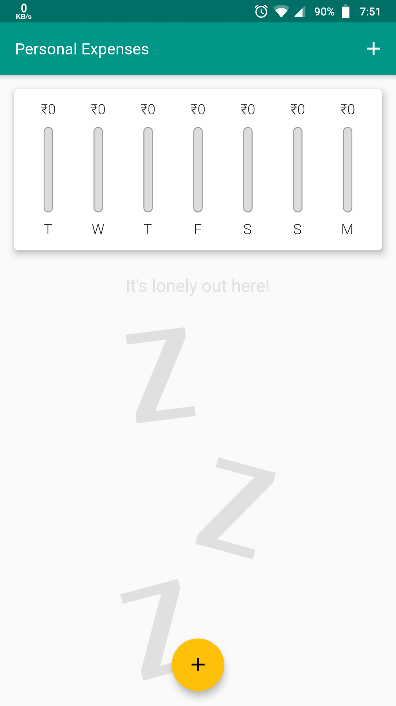
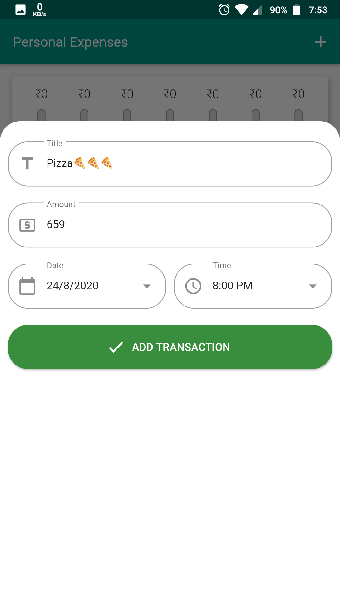
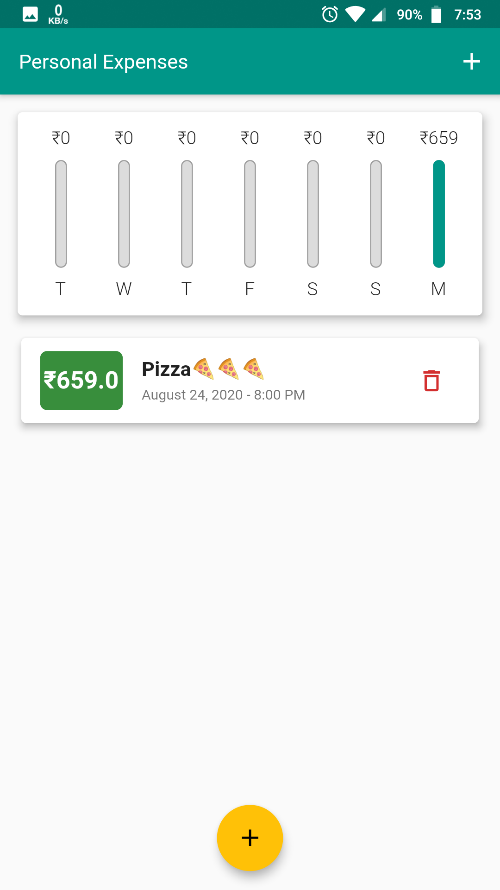
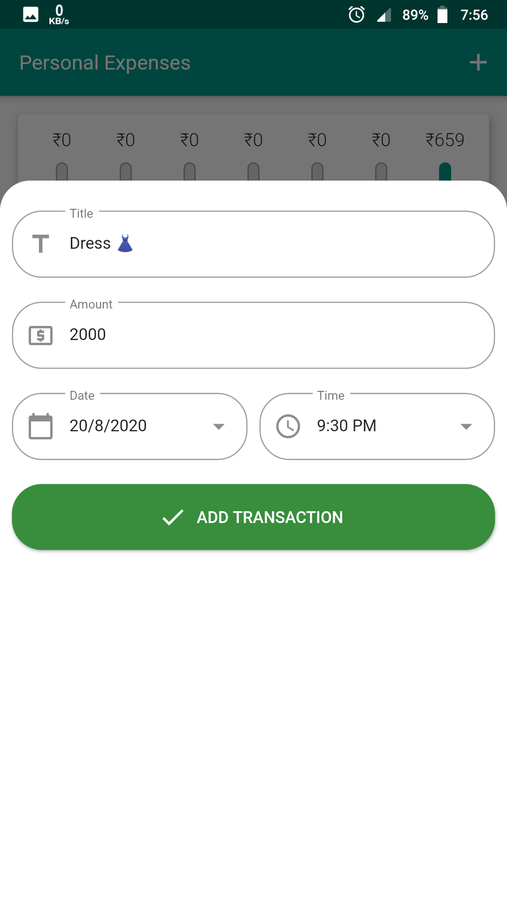
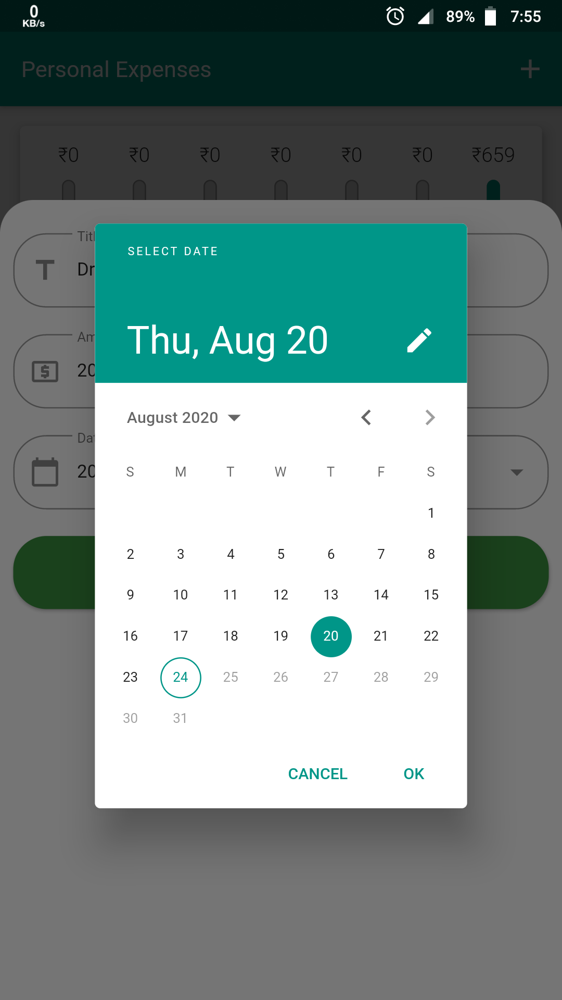
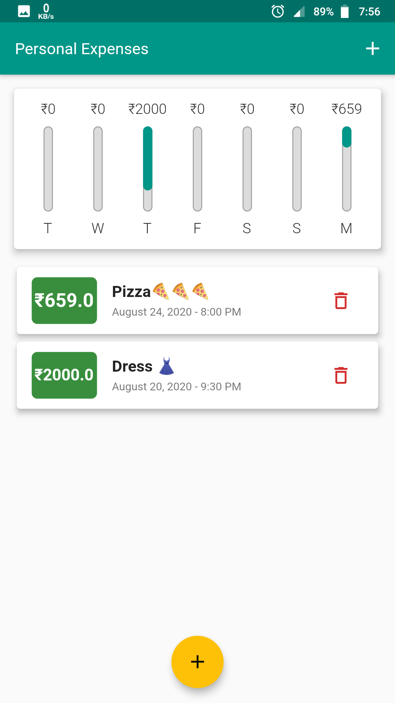

#Group Members name and Id
Name.        Id
1. Abdullah Yousuf UGR/8437/14
2. Abrham Fantahun UGR/0951/14
3. Daniel Habtu UGR/7471/14
4. Emanuel Kibru UGR/1626/14
5. Hamza Mohammed UGR/6708/14
6. Natnael Mesfin UGR/1853/14
   
# Expense Manager App using Flutter

Expense Manager can track your expenses and even show you last week's per day expenses in a simple chart. Expenses are stored locally in the device using SQLite Database. 

## Features
- Last week transactions summary.
- Simple and intuitive UI.
- Beautiful Material Design.
- Uses SQLite for storing data locally in your device hence great privacy.
- Works offline.

## Screenshots

## Getting Started with Flutter

This project is a starting point for a Flutter application.

A few resources to get you started if this is your first Flutter project:

- [Lab: Write your first Flutter app](https://flutter.dev/docs/get-started/codelab)
- [Cookbook: Useful Flutter samples](https://flutter.dev/docs/cookbook)

For help getting started with Flutter, view our
[online documentation](https://flutter.dev/docs), which offers tutorials,
samples, guidance on mobile development, and a full API reference.

